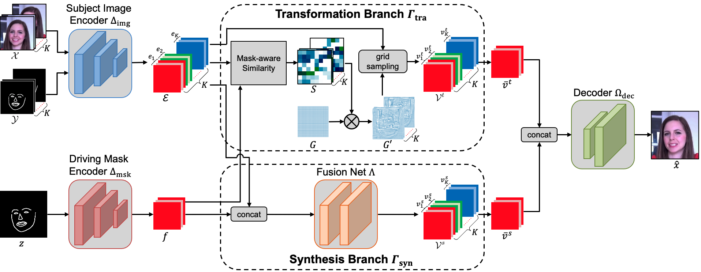

TS-Net
====

The pytorch implementation of our WACV23 paper [Cross-identity Video Motion Retargeting with Joint Transformation and Synthesis](https://arxiv.org/abs/2210.01559).

<div align=center></div>

Updates
-----
[Updated on 03/23/2023] Released a testing demo for dance dataset.

[Updated on 03/22/2023] Released a testing demo for face dataset.

Example videos
----
Some generated video results on FaceForensics dataset.

<div align=center>


</div>

Some generated video results on Youtube-dance dataset.

<div align=center>


</div>

Dependencies
----
Python 3.7.10, Pytorch 1.10.2, etc.

Pretrained Models
------
|Dataset|Link (Google Drive)|
|------|-----|
|FaceForensics|https://drive.google.com/file/d/19BlI2XeogcOmPT4MALzqesRfpGu9E8Py/view?usp=share_link|
|Youtube-dance|https://drive.google.com/file/d/1pFANbb1_kCxIwrMXZUD3NGFd9RKb1fHw/view?usp=share_link|

Demo
-------
**FaceForensics**
1. Install required dependencies. Here we use Python 3.7.10, Pytorch 1.10.2, etc.
2. Set the paths in the code files if needed. The pretrained model for FaceForensics dataset has released.
3. Run `python -u demo/demo_face.py`

**Youtube-dance**
1. Install required dependencies. Here we use Python 3.7.10, Pytorch 1.10.2, etc.
2. Set the paths in the code files if needed. The pretrained model for Youtube-dance dataset has released.
3. Run `python -u demo/demo_pose.py`

Note that our models are only trained on less than 200 short videos. So they are still hard to be generalized to *unseen* subjects. The subject videos of example videos we shown are *seen*, which are from training dataset (Driving videos are still unseen). If you want to apply our model to new subject, please do some fine-tuning. This can be achieved by using our training code to train TS-Net on the new subject with a small learning rate. The following section shows a toy example about how to train TS-Net.

Training TS-Net
----

The following codes show a toy example about how to train TS-Net. The complete training framework can refer to ``train_face.py`` and ``train_pose.py``.
```python
# this code will show a toy example about how to train our model
import torch
from model.TSNet import TSNet
import os

# setting GPU
os.environ["CUDA_VISIBLE_DEVICES"] = "6"

# our model requires landmark/keypoint labels
label_nc = 2

bs = 4
# source, i.e., subject videos
# here we make some fake data for illustration
src_img_batch_list = []
src_lbl_batch_list = []
src_bbox_batch_list = []  # bounding box for mask-aware similarity matrix computation
for i in range(3):
    src_img_batch = torch.rand((bs, 3, 256, 256)).cuda()
    src_lbl_batch = torch.randint(low=0, high=2, size=(bs, label_nc, 256, 256)).cuda().to(torch.float32)
    src_bbox_batch = torch.randint(low=0, high=2, size=(bs, 256, 256)).cuda().to(torch.float32)
    src_img_batch_list.append(src_img_batch)
    src_lbl_batch_list.append(src_lbl_batch)
    src_bbox_batch_list.append(src_bbox_batch)

# target, i.e., driving videos
tar_img_batch = torch.rand((bs, 3, 256, 256)).cuda()
tar_lbl_batch = torch.randint(low=0, high=2, size=(bs, label_nc, 256, 256)).cuda().to(torch.float32)
tar_bbox_batch = torch.randint(low=0, high=2, size=(bs, 256, 256)).cuda().to(torch.float32)

# model architecture
model = TSNet(is_train=True, label_nc=label_nc,
              n_blocks=0, debug=False,
              n_downsampling=3,
              n_source=3).cuda()

# setting training input
model.set_train_input(src_img_list=src_img_batch_list,
                      src_lbl_list=src_lbl_batch_list,
                      src_bbox_list=src_bbox_batch_list,
                      tar_img=tar_img_batch, tar_lbl=tar_lbl_batch,
                      tar_bbox=tar_bbox_batch)

# one training step to update TS-Net
model.optimize_parameters()
```

Citing TS-Net
----
If you find our approaches useful in your research, please consider citing:
```
@InProceedings{Ni_2023_WACV,
    author    = {Ni, Haomiao and Liu, Yihao and Huang, Sharon X. and Xue, Yuan},
    title     = {Cross-Identity Video Motion Retargeting With Joint Transformation and Synthesis},
    booktitle = {Proceedings of the IEEE/CVF Winter Conference on Applications of Computer Vision (WACV)},
    month     = {January},
    year      = {2023},
    pages     = {412-422}
}
```
For questions with the code, please feel free to open an issue or contact me: homerhm.ni@gmail.com

Acknowledgement
----
Part of our code was borrowed from [pix2pixHD](https://github.com/NVIDIA/pix2pixHD), [vid2vid](https://github.com/NVIDIA/vid2vid), and [fs-vid2vid](https://github.com/NVlabs/few-shot-vid2vid). We thank the authors of these repositories for their valuable implementations.
